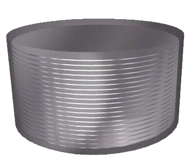

.. |s| unicode:: 0xA0 

    
.. header::
    .. list-table::
        :class: header-box
        :align: left
        :widths: 90 10
        
        * - **rivtbook Example - Introduction** - v1.0.0a12 |s| |s| |s| |s|  **###Section###**
          - p. **###Page###**   

          

.. footer:: 
    .. list-table::
        :class: footer-box
        :align: left
        :widths: 84 22 16
        
        * - 2026-06-29 |s| |s| |s| **|** |s| |s| |s| R Holland        
          - **rivt**        
          - |blklogo|

                  

.. role:: btext
   :class: big-text

.. role:: mtext
    :class: medium-text

.. role:: stext
    :class: small-text

|
|
|
|
        

|
|
|
|
|

.. rst-class:: center

    :mtext:`Isolation Bearing Design`

|

.. rst-class:: center

    :btext:`rivtbook Example - Introduction`
    
|
|
|
|
|

.. rst-class:: center

    :mtext:`Example 04 - rivtbook`

|

.. rst-class:: center

    :stext:`proj. 0004`

   
.. raw:: pdf

   PageBreak noHead
      
**rivtbook Example - Introduction** - v1.0.0a12

--------------------

|

.. contents:: Table of Contents
  :depth: 1

  
.. raw:: pdf
 
   PageBreak mainPage
   SetPageCounter 1

 
.. raw:: pdf

   PageBreak

      

.. _rivtbook Example:

**0.1** | rivtbook Example
================================================================================
 
A rivtbook is a collection of rivt files with a common subject and organized
for selective addition to rivt docs and reports. A rivtbook may be published as
a PDF or text report to facilitate review and selection of chapters.
 
rivtbooks do not need to be organized into divisions. A sequence of chapters
is sufficient as chapters will be renumbered in the target report. The folder
structure for rivtbooks faciliates copy-paste of chapters. 
 
The rivt file and its source files are contained within the same folder
(orange). A rivtbook chapter can be imported into a rivt report by copying
the *rivt file* (blue) to the *rivt-report* folder and its source folders
(green) to the *rvsrc* folder.
 
 

.. figure:: c:/git/rivtbk-example-04-git/bk1-Introduction/img/rvbk-rivt.jpg
   :width: 100%
   :align: center

   **Fig. 1** - Relation Between rivtbook and rivt Folders   
    

 
 
