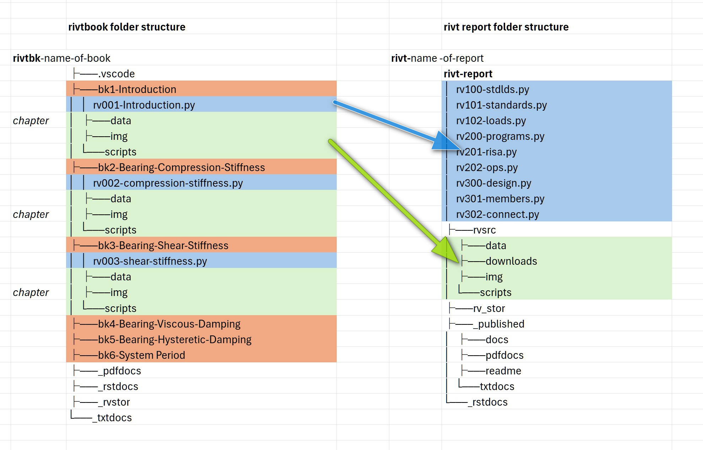

 
.. raw:: pdf

   PageBreak

      

.. _Introduction:

**0.1-1** | Introduction
================================================================================
 
A rivtbook is a collection of rivt files with common subject matter that
may be published as a PDF or text report. The files are organized under a
root folder rivtbk- with a name that identifies the subject matter. Each
rivt doc is contained within a chapter folder that includes the 
rivt file its associated sources. This facilitates extracting single docs 
or merging a chapter into a rivt report. 
 
 

.. code-block:: text 

            rivtbook Folder Structure

            rivtbk-subject-matter 
            ├── bk1-chapter title            
                    ├── data/                    
                    ├── image/                        
                    ├── scripts/
                    └── rv001-book-chapter.py
            └── bk2-chapter title            `
                        ├── data/                    
                        ├── image/                        
                        ├── scripts/
                        └── rv002-book-chapter.py
    
    

 
A rivtbook chapter may be copied to a rivt report by:
 
#. merging the data, image and scripts folders into the /rvsrc folder 
#. copying the rivt file to the /rivt-report folder.
 

   **Fig. 1.1** - rivtbook chapter copied to a report   
    

 
 
